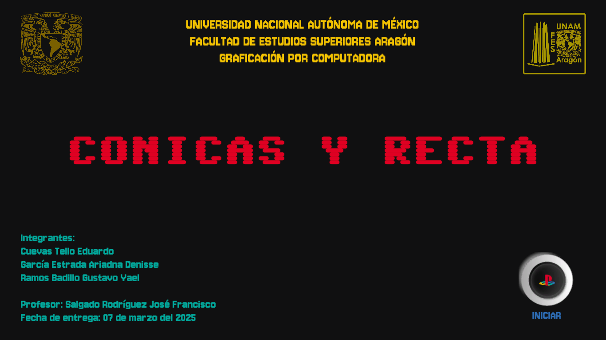
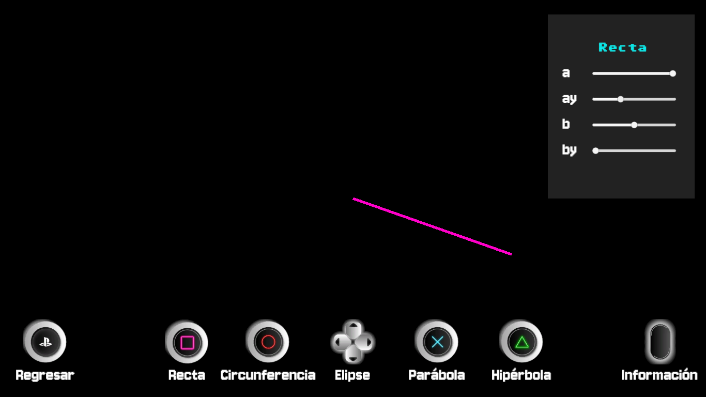
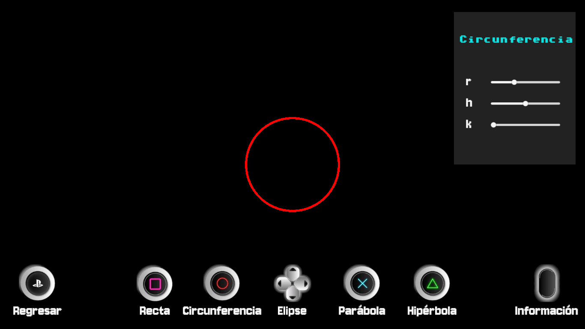
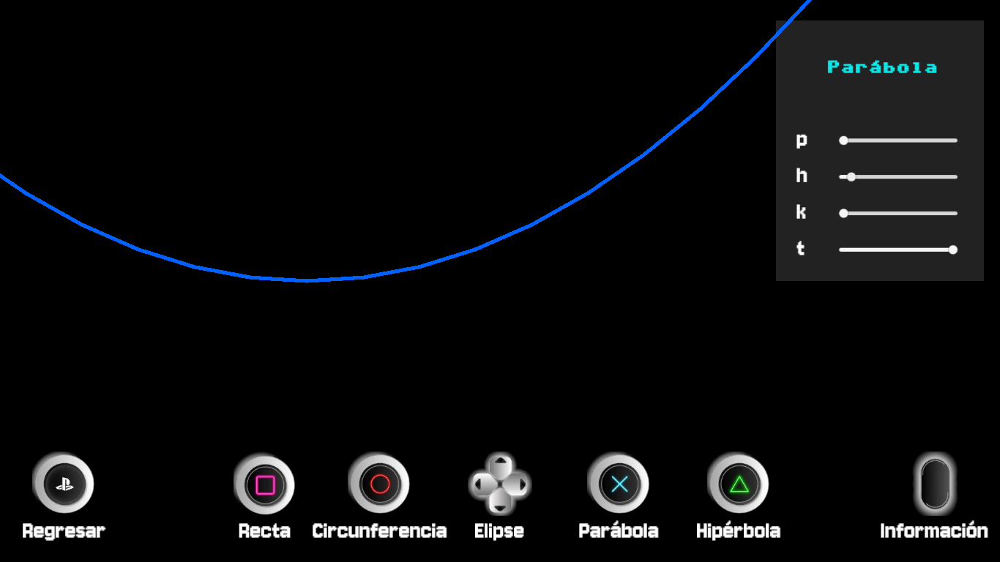
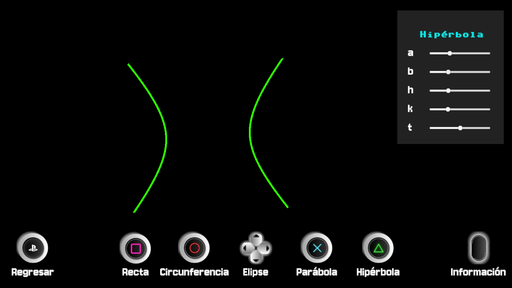
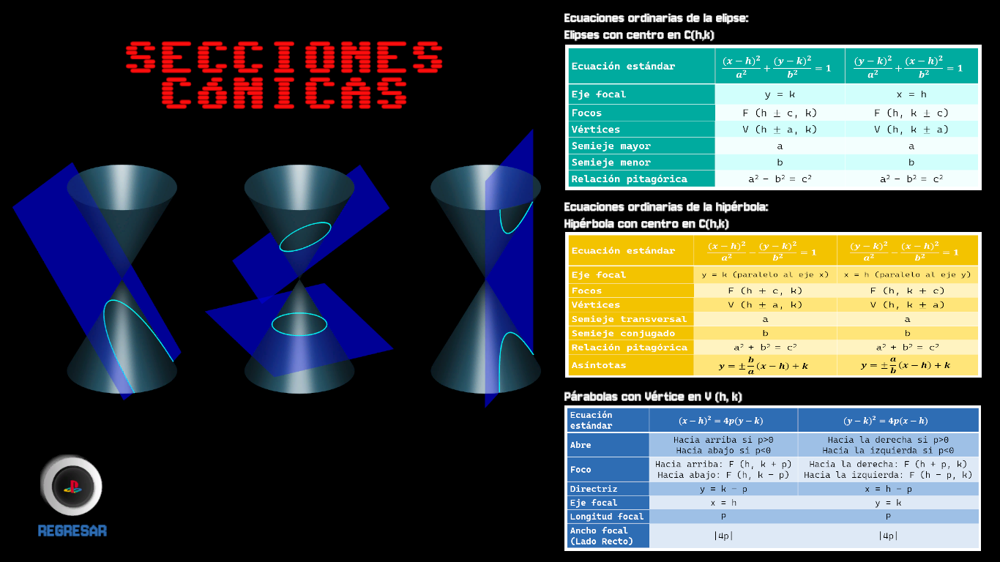

# CÓNICAS Y RECTA 💫

### Propósito General
Este proyecto en Unity está diseñado para dibujar diferentes tipos de **secciones cónicas** (recta, circunferencia, elipse, parábola e hipérbola) utilizando un LineRenderer. Permite al usuario ajustar los parámetros de cada cónica a través de sliders en la interfaz de usuario (UI).

### Resultado
Se proporciona un ejecutable con la temática de PlayStation,  que permite visualizar y manipular secciones cónicas en Unity en tiempo real.

A continuación se muestran imagénes del ejecutable.
#### Inicio

#### Recta 

#### Circunferencia

#### Elipse 

#### Parábola

#### Hipérbola

#### Información

## Colaboradores ✍🏼
El proyecto fue realizado para la materia de *Graficación por Computadora* en la Facultad de Estudios Superiores Aragón durante el semestre **2025-II**.

💻 Cuevas Tello Eduardo **([cuevasedu04](https://github.com/cuevasedu04))**  
💻 Ariadna Denisse García Estrada **([ariadna-ge](https://github.com/ariadna-ge))**  
💻 Gustavo Yael Ramos Badillo **([Yae1Ram0s](https://github.com/Yae1Ram0s))**  